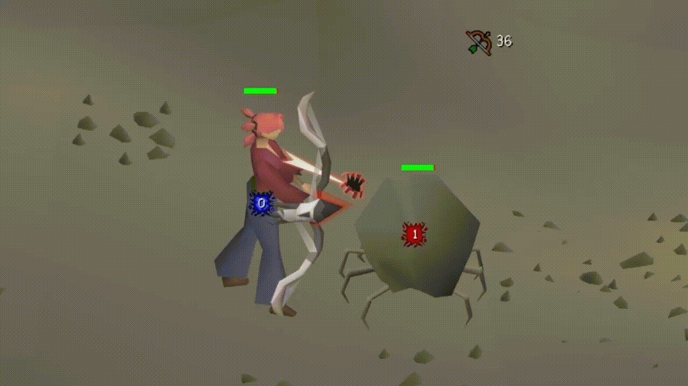

# Webweaver Swap

RuneLite Plugin Hub plugin that swaps Webweaver bow visuals to Craw's bow.

## Features

- Swap the Webweaver shot visuals to Craw's bow
- Optionally render the equipped Webweaver bow as Craw's bow on the local player

## Config

- `Use Craw's bow animation`
- `Use Craw's bow model`

## Comparison

Default Webweaver shot followed by Webweaver Swap using Craw's bow visuals.



## Development

Run the plugin in a development client with:

```powershell
.\gradlew.bat run
```

Build the distributable jar with:

```powershell
.\gradlew.bat shadowJar
```
